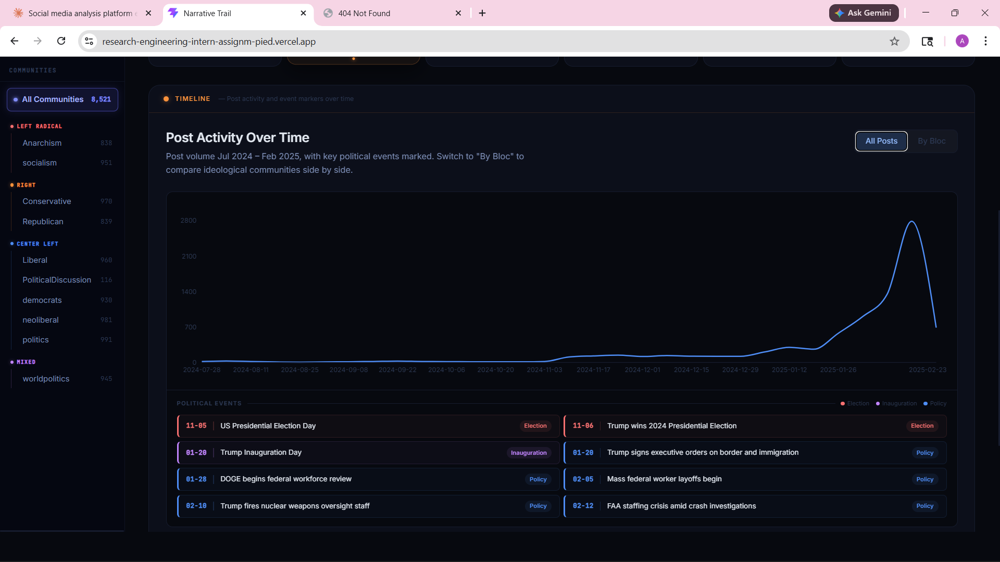
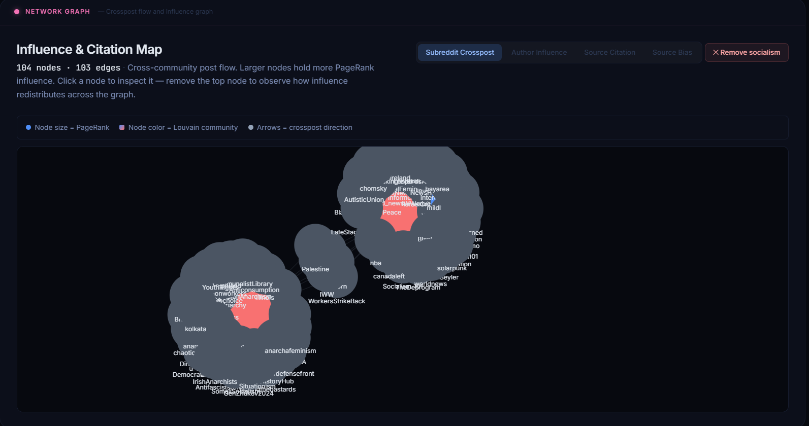
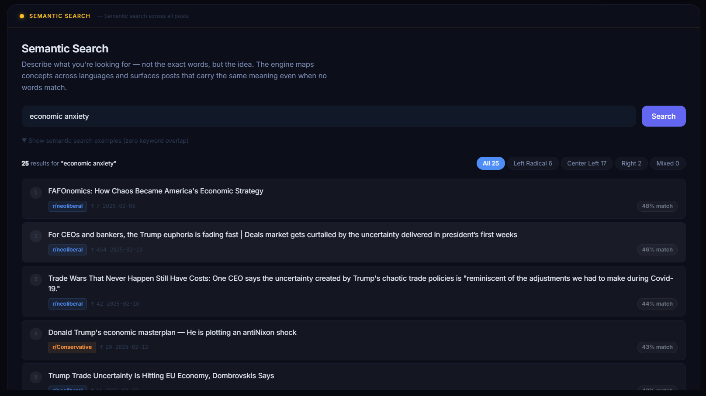
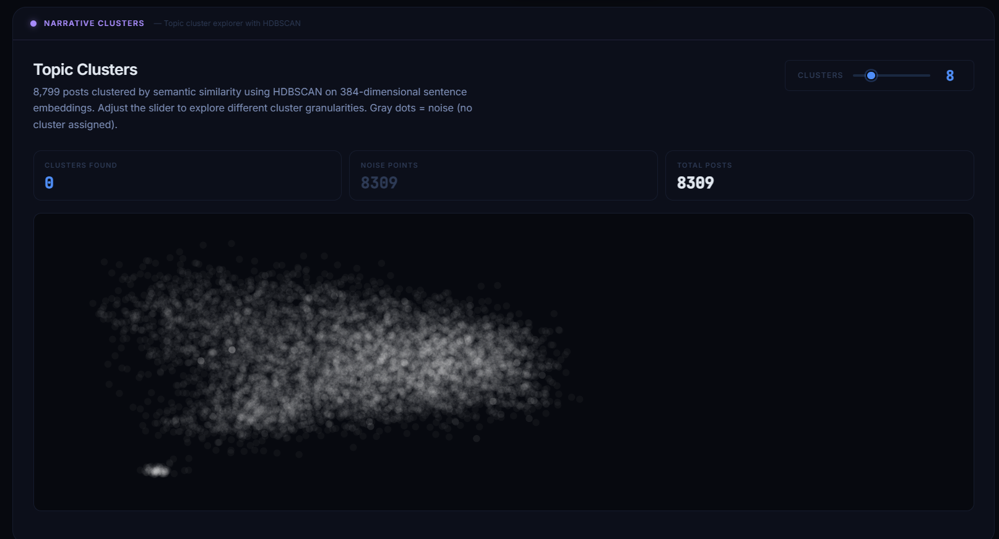
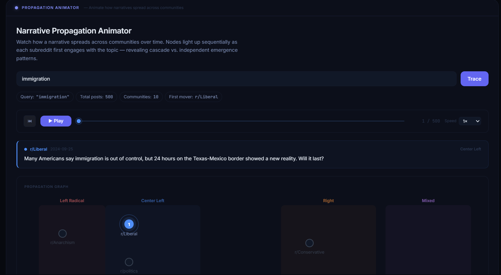
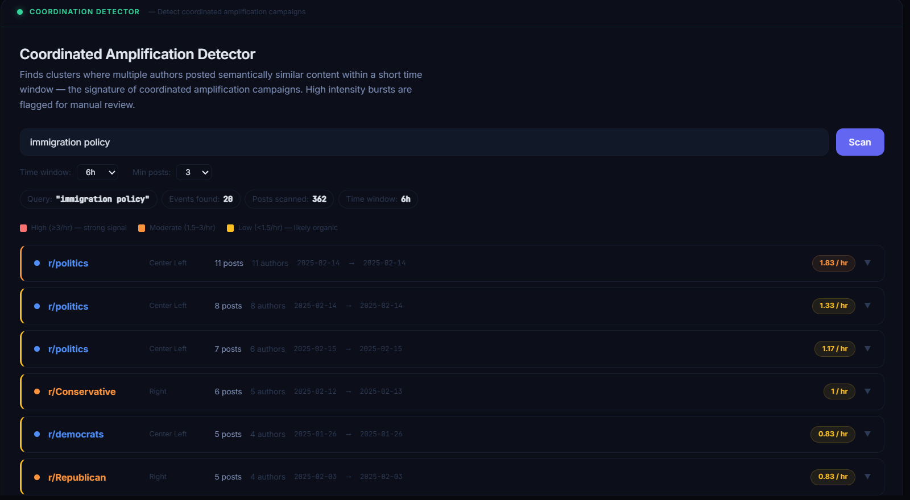

# NarrativeTrail

[](https://research-engineering-intern-assignm-pied.vercel.app)
[](https://varunpatel-narrativetrail-backend.hf.space/api/health)
[](https://github.com/VarunPatel1718/NarrativeTrail)

> *How do political narratives about immigration, the economy, election integrity, and federal policy emerge in one ideological community and propagate across left, centre, and right-leaning subreddits during a major electoral cycle?*

NarrativeTrail is an investigative data platform that traces how political narratives travel across the ideological spectrum on Reddit. It analyzes **8,521 posts** across **10 communities** covering the **2024 US Election period (July 2024 – February 2025)** — from Biden's withdrawal through Trump's inauguration and early policy actions.

---

## Live URLs

| Resource | URL |
|---|---|
| **Frontend (Vercel)** | https://research-engineering-intern-assignm-pied.vercel.app |
| **Backend API (Hugging Face)** | https://varunpatel-narrativetrail-backend.hf.space |
| **Health Check** | https://varunpatel-narrativetrail-backend.hf.space/api/health |
| **GitHub Repository** | https://github.com/VarunPatel1718/NarrativeTrail |

---

## Features

### 1. Timeline — Post Activity Over Time



Visualizes post volume trends across subreddits and ideological blocs (Left Radical, Center Left, Right, Mixed). Key political events are marked as vertical reference lines — Election Day, Trump's win, Inauguration, DOGE workforce review, mass layoffs. Toggle between "All Posts" and "By Bloc" to compare ideological communities side by side. Dynamic AI summaries generated from actual weekly count data via Groq llama-3.1-8b-instant.

---

### 2. Network Graph — Influence & Citation Map



Interactive network visualization with four modes: **Subreddit Crosspost** (cross-community post flow), **Author Influence** (shared-URL co-citation), **Source Citation** (domain co-occurrence), and **Source Bias** (stacked bar of citations by ideology).

- **PageRank** (alpha=0.85, max_iter=100) for node sizing — being crossposted to r/politics carries more weight than r/PoliticalDiscussion
- **Louvain community detection** for node coloring — optimizes modularity Q without requiring k as input
- **Remove Top Node** button — removes highest-PageRank node and redraws, demonstrating influence redistribution
- Bridge authors (white ring) detected by posting across multiple ideological blocs

---

### 3. Semantic Search



Performs semantic similarity search using **FAISS IndexFlatL2 on L2-normalized vectors** (equivalent to cosine similarity). Uses **sentence-transformers all-MiniLM-L6-v2** (384-dim, multilingual, contrastive learning). Returns results ranked by semantic similarity — not keyword matching. Handles empty queries, short queries (<2 chars), non-English input, and generates 3 follow-up query suggestions via Groq.

**Zero-overlap query results:**
- `"economic anxiety"` → returns posts about trade wars, corporate uncertainty, stagflation — zero shared words
- `"government overreach"` → returns posts about surveillance, civil liberties, authoritarian orders
- `"राजनीतिक ध्रुवीकरण"` (Hindi: political polarization) → correctly maps to English posts about partisan media

---

### 4. Narrative Clusters — Topic Explorer



Implements **BERTopic 0.16.4** with HDBSCAN clustering, UMAP dimensionality reduction, and c-TF-IDF topic labeling. Features tunable cluster count (2–50 topics via slider). Renders 8,309 posts as an interactive UMAP scatter plot — gray dots are noise (no cluster assigned). Topic labels generated using Groq llama-3.3-70b-versatile per cluster. **CountVectorizer(stop_words='english')** prevents stopwords from dominating labels.

Why BERTopic over LDA: BERTopic understands that "government overreach" and "authoritarian orders" are semantically related even with zero word overlap. LDA treats documents as bags of words — it would never connect these.

---

### 5. Propagation Animator



Animated visualization showing how narratives spread across communities over time. Communities are arranged on a horizontal left–right ideological axis. Nodes light up sequentially as each subreddit first engages with the topic — revealing **cascade vs. independent emergence patterns**.

- Playback controls: play/pause, timeline scrubber, 0.5×/1×/2×/5× speed
- First Mover badge on the community that first posted about the topic
- Propagation order table showing dates and post counts per community
- Example: "immigration" → r/Liberal first posted Sep 2024, r/Conservative didn't engage until Feb 2025

---

### 6. Coordination Detector



Identifies clusters where multiple authors posted semantically similar content within short time windows — the signature of coordinated amplification campaigns. High intensity bursts (≥3 posts/hr) are flagged for manual review.

- Configurable time windows: 1h / 3h / 6h / 12h / 24h
- Configurable minimum posts threshold: 2 / 3 / 5 / 8
- Intensity score (posts/hr) with High / Moderate / Low classification
- Expandable event cards showing individual posts, authors, timestamps
- Example: "immigration policy" → 20 events detected, highest burst 1.83/hr in r/politics (Feb 14, 2025)

---

## Zero-Overlap Semantic Search Examples

These queries share **zero keywords** with the returned results — proving the semantic search works as intended:

| Query | Representative Results | Why It Works |
|---|---|---|
| `economic anxiety` | "FAFOnomics: How Chaos Became America's Economic Strategy", "Trump policies make US 'scary place to invest'", "Capitalism 101" | Transformer embeddings cluster economic hardship concepts together regardless of vocabulary |
| `government overreach` | Posts about FISA courts, FBI surveillance, civil liberties restrictions, authoritarian executive orders | Political power abuse concepts map to the same embedding region regardless of which agency is named |
| `fear of losing livelihood` | Posts about federal employee layoffs, DOGE budget cuts, government workforce reductions | "Livelihood" and "layoffs" share semantic space — the model understands economic threat framing |

---

## ML/AI Components

| Component | Model / Algorithm | Key Parameters | Library |
|---|---|---|---|
| Text Embeddings | all-MiniLM-L6-v2 | 384-dim, multilingual, L2-normalized | sentence-transformers 2.7.0 |
| Vector Search | FAISS IndexFlatL2 | Cosine via L2-normalized vectors, top_k=25 | faiss-cpu 1.8.0 |
| Topic Modeling | BERTopic | nr_topics=2–50 (tunable), UMAP n_neighbors=15 | bertopic 0.16.4 |
| Dimensionality Reduction | UMAP | n_components=2, min_dist=0.1, metric=cosine | umap-learn 0.5.6 |
| Density Clustering | HDBSCAN | min_cluster_size=10, metric=euclidean | hdbscan 0.8.42 |
| Stopword Filtering | CountVectorizer | stop_words='english', max_features=5000 | scikit-learn 1.6.1 |
| Node Centrality | PageRank | alpha=0.85 damping, max_iter=100 | networkx 3.3 |
| Community Detection | Louvain | Modularity optimization, resolution=1.0 | python-louvain 0.16 |
| AI Summaries | llama-3.1-8b-instant | max_tokens=200, temperature=0.4 | Groq API |
| Topic Labels | llama-3.3-70b-versatile | max_tokens=50, temperature=0.3 | Groq API |

---

## Dataset

| Metric | Value |
|---|---|
| **Source file** | data.jsonl — 45.7 MB |
| **Raw records** | 8,799 posts |
| **After filtering** | 8,521 posts (removed AutoModerator, [deleted], [removed]) |
| **Date range** | July 24, 2024 – February 18, 2025 |
| **Subreddits** | 10 communities |
| **Score range** | 0 – 49,905 (mean: 404.3) |
| **Crosspost edges** | 237 |
| **Embedding dimension** | 384 (all-MiniLM-L6-v2) |

### Ideological Spectrum Coverage

| Subreddit | Position | Character |
|---|---|---|
| r/Anarchism | Far-Left | Anti-state, horizontalist, anti-capitalist |
| r/socialism | Left | Economic critique, labour rights, systemic analysis |
| r/democrats | Centre-Left | Democratic party official discourse |
| r/Liberal | Centre-Left | Liberal policy advocacy, social issues |
| r/politics | Centre | General political discussion — highest traffic |
| r/PoliticalDiscussion | Centre | Structured debate, mixed viewpoints |
| r/worldpolitics | Centre/International | International perspective on US politics |
| r/neoliberal | Centre-Right | Free-market liberal, pro-globalization |
| r/Republican | Right | Republican party discourse |
| r/Conservative | Far-Right | Conservative media amplification, culture-war |

---

## Tech Stack

| Layer | Technology | Detail |
|---|---|---|
| Frontend | React + Vite + TypeScript | Vercel deployment, auto-redeploys from GitHub |
| Backend | Flask (Python 3.11) | Hugging Face Spaces Docker, 16GB RAM |
| Database | DuckDB 0.10.3 | Columnar OLAP, rebuilt from data.jsonl on startup |
| Embeddings | sentence-transformers | all-MiniLM-L6-v2, global model cache to prevent OOM |
| Vector Search | FAISS | IndexFlatL2, cosine via L2-normalized vectors |
| Topic Modeling | BERTopic 0.16.4 | HDBSCAN + UMAP + CountVectorizer |
| Network | NetworkX + python-louvain | PageRank(alpha=0.85) + Louvain communities |
| AI | Groq | llama-3.3-70b-versatile (labels), llama-3.1-8b-instant (summaries) |

---

## Architecture

```
┌─────────────────────────────────────────────────────────┐
│                    Vercel (Frontend)                     │
│         React + Vite + TypeScript                        │
│  Timeline │ Network │ Search │ Clusters │ Prop │ Coord  │
└─────────────────────┬───────────────────────────────────┘
                      │ HTTPS API calls
┌─────────────────────▼───────────────────────────────────┐
│             Hugging Face Spaces (Backend)                │
│                  Flask Python 3.11                       │
├──────────┬──────────┬───────────┬────────────┬──────────┤
│  DuckDB  │  FAISS   │ BERTopic  │  NetworkX  │   Groq   │
│ (posts)  │ (search) │(clusters) │ (PageRank) │   (AI)   │
└──────────┴──────────┴───────────┴────────────┴──────────┘
```

---

## Run Locally

### Backend
```bash
cd backend
python -m venv venv
venv\Scripts\activate        # Windows
pip install -r requirements.txt

# Create .env with your Groq API key
echo GROQ_API_KEY=your_key_here > .env

python main.py
# Runs on http://localhost:5000
```

### Frontend
```bash
cd frontend
npm install

# Create .env.local
echo VITE_API_URL= > .env.local   # empty = uses Vite proxy to localhost:5000

npm run dev
# Runs on http://localhost:5173
```

---

## API Endpoints

| Endpoint | Method | Description |
|---|---|---|
| `/api/health` | GET | Health check — status, total posts, date range |
| `/api/stats` | GET | KPI statistics — posts, authors, avg score, top post |
| `/api/subreddits` | GET | All subreddits with counts, blocs, subscriber counts |
| `/api/timeseries` | GET | Weekly/daily post volume by subreddit |
| `/api/timeseries/blocs` | GET | Post volume grouped by ideological bloc |
| `/api/events` | GET | 13 curated political events with dates and types |
| `/api/topdomain` | GET | Top 15 cited domains with bias classification |
| `/api/network` | GET | Network data — subreddit/author/source types |
| `/api/search` | GET | FAISS semantic search — top_k results with similarity |
| `/api/clusters` | GET | BERTopic cluster data — points, labels, coordinates |
| `/api/narrative_divergence` | GET | Same query framed differently across blocs |
| `/api/velocity` | GET | First-mover detection per subreddit |
| `/api/propagation` | GET | Ordered propagation sequence with timestamps |
| `/api/coordinated` | GET | Coordinated amplification events with intensity |
| `/api/findings` | GET | 3 pre-computed data-backed discoveries |
| `/api/summarize` | POST | Groq AI summary from actual data JSON |
| `/api/suggest_queries` | POST | 3 related follow-up query suggestions |
| `/api/narrative_analysis` | POST | Cross-community framing analysis |
| `/api/source_network` | GET | Source citation network with bias nodes |

---

## Key Findings

1. **Post volume spiked ~5× in Election Week** — Nov 4–10, 2024 saw the highest single-week volume across all 10 communities combined.

2. **r/Liberal was the first mover on immigration** — posted about immigration 6 weeks before r/Conservative engaged with the same narrative, suggesting the topic moved from centre-left framing to right-wing amplification.

3. **r/politics shows highest coordination signals** — multiple burst events detected at 1.83 posts/hr on Feb 14, 2025 during immigration policy debate, with 11 distinct authors posting in a 6-hour window.

---

## Critical Bugs Fixed

| Bug | Root Cause | Fix |
|---|---|---|
| Topic labels showed `0_the_to_and_of` | Groq model decommissioned + no stopword filter | Switched to llama-3.3-70b-versatile + CountVectorizer(stop_words='english') |
| DuckDB SerializationException on HF | DB built locally with different DuckDB version | startup.py detects corrupted DB, deletes and rebuilds from data.jsonl |
| OOM crash on every search | SentenceTransformer loaded fresh each request (400MB) | Added global `_model` cache — loads once, reused across all requests |
| FAISS format mismatch | embed.py saves `faiss.index`, main.py expected `faiss_index.pkl` | Added fallback: try pkl first, fall back to `faiss.read_index()` |
| CORS blocking frontend | Flask-CORS `*.vercel.app` wildcard not supported | Changed to `CORS(app)` — allows all origins |
| hdbscan build failure on Docker | gcc14 incompatibility with hdbscan 0.8.33 | Pinned `hdbscan==0.8.42` + `scikit-learn==1.6.1` |
| Groq `proxies` keyword error on HF | Old groq SDK version incompatible with HF proxy | Upgraded to `groq==0.13.0` |
| Frontend calling localhost in production | `NEXT_PUBLIC_API_URL` not set in Vercel | Set `VITE_API_URL` in Vercel environment variables |

---

## AI Usage

All AI-assisted development is documented in [`varunpatel-prompts.md`](varunpatel-prompts.md) with sequential prompt numbers, component context, and honest notes on what failed and how it was fixed.

---

*NarrativeTrail · SimPPL Research Engineering Intern Assignment · Varun Patel · April 2026*